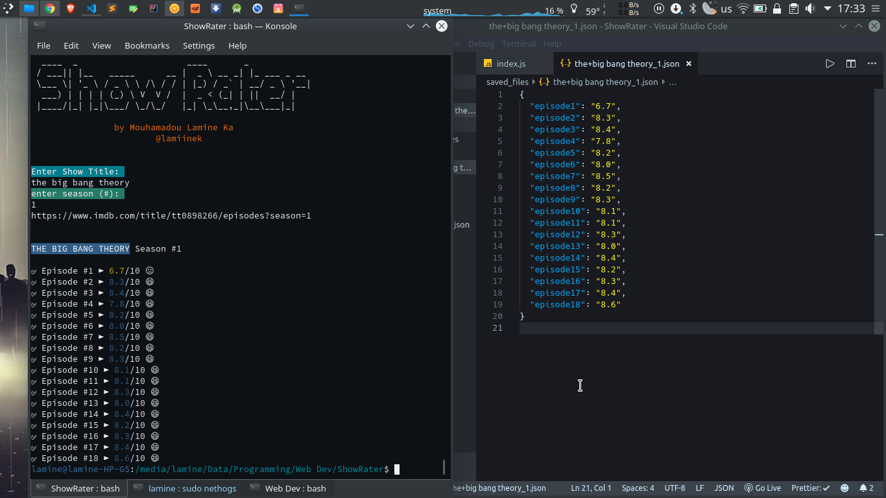

# ShowRater
Simple Node JS command line application that will get and save the rating of any specified TV show. 

## Install & Usage
require node.js to run

open a terminal in the directory containing the files and run
* npm install (_install all dependencies_)
* npm start 

